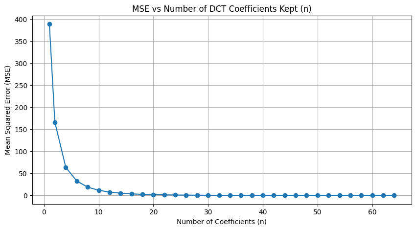
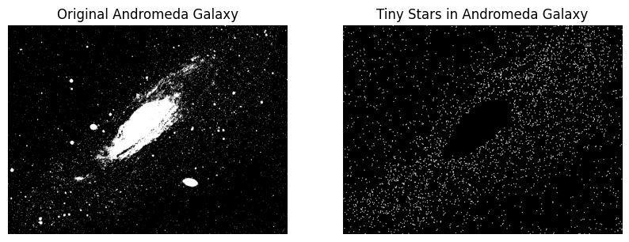

# Digital Image Processing Course - Homework Solutions

This repository contains my solutions to six homework assignments from the **Digital Image Processing** course. Each assignment focuses on different aspects of image processing, including signal processing, transformations, and machine learning techniques applied to images. The solutions are implemented in Python using Jupyter notebooks, with a combination of theoretical explanations and practical algorithm implementations.

## Table of Contents

1. [Homework 1: Image Kernels & Fourier Series](#homework-1-image-kernels--fourier-series)
2. [Homework 2: Quantization Techniques](#homework-2-quantization-techniques)
3. [Homework 3: Convolution & DCT Compression](#homework-3-convolution--dct-compression)
4. [Homework 4: CLAHE & Filter Comparison](#homework-4-clahe--filter-comparison)
5. [Homework 5: Hough Transform, Segmentation & K-Means](#homework-5-hough-transform-template-matching--k-means-segmentation)
6. [Homework 6: Compression & Morphological Operations](#homework-6-compression--morphological-operations)

---

## Homework 1: Image Kernels & Fourier Series

### Part 1: Image Kernels
In this task, I applied the provided kernel to the image `image1`. Additionally, I experimented with two other kernels and compared the resulting images to understand how different kernels affect image processing.

### Part 2: Fourier Series
I explored Fourier transformations by calculating the Fourier coefficients of `image2` and visualizing the transformed image. I then reconstructed the image step by step by summing sinusoidal signals, demonstrating the power of Fourier synthesis.

  

  <em>Visualization of reconstructed image using the fourier synthesis.</em>

---

## Homework 2: Quantization Techniques

This homework focused on various quantization methods, including:

- **Part a**: I explained the concept and purpose of quantization in digital image processing.
- **Part b**: I applied uniform quantization with 4 levels to a given set of values, visualized the results, and calculated the Mean Squared Error (MSE).
- **Part c**: I implemented a custom `quantizer` function to quantize an image using decision and reconstruction levels.
- **Part d/e**: I implemented Lloyd-Max and uniform quantization methods and analyzed their effects on a given image, comparing histograms and MSE.

  

  <em>Visual comparison of the original image, uniform quantization, and Lloyd-Max quantization, alongside their corresponding histograms, highlighting differences in compression and detail retention.</em>

---

## Homework 3: Convolution & DCT Compression

### Part 1: Convolution
I implemented both standard and circular convolution on images, experimenting with different kernels and observing the resulting transformations.

### Part 2: DCT Image Compression
I utilized the Discrete Cosine Transform (DCT) to compress images, experimenting with different compression ratios and assessing the visual quality and efficiency of the compression.

  

  <em>Visualization of DCT compression and decompression with varying coefficients (n = 1, 2, 4, 6, 8, 10), illustrating the impact on image quality.</em>

 

<table>
  <tr>
    <td align="center">
      
      
<em>(a)</em>

    </td>
    <td align="center">
      
      
<em>(b)</em>

    </td>
  </tr>
</table>

  <em>Plot (a) shows the MSE of the decompressed image versus DCT coefficients (n), while plot (b) compares the PSNR of the decompressed image as a function of n.</em>

---

## Homework 4: CLAHE & Filter Comparison

### Part 1: CLAHE Implementation
I implemented Contrast Limited Adaptive Histogram Equalization (CLAHE) from scratch and applied it to `image1.jpg`. CLAHE enhances image contrast while preventing over-amplification in high-contrast areas by processing small tiles in the image.

  

  <em>Comparison of the original image and the CLAHE-enhanced image, highlighting improved contrast and detail preservation in the enhanced version.</em>

### Part 2: Wiener vs. Inverse Filtering
I compared the performance of Wiener and inverse filters on an image that was both blurred and noisy, evaluating which method provided better restoration.

  

  <em>(a) Noise-free situation</em>

  

  <em>(b) Noisy situation</em>

  <em>Comparison of inverse and Wiener filters for noise-free image restoration in (a) and noisy image restoration in (b), with PSNR values in the titles indicating image quality relative to the original.</em>

---

## Homework 5: Hough Transform, Template Matching & K-Means Segmentation

### Part 1: Hough Transform
I implemented the Hough transform from scratch to detect lines on a chessboard image (`chess.jpg`). I developed an algorithm to remove non-relevant lines and identified chessboard corners.

  

  <em>Visualization of detected lines on chess image using Hough transform.</em>

### Part 2: Image Template Matching
I applied template matching techniques to the image `birds.jpg`, aiming to detect the birds without using external libraries.

  

  <em>Detected birds in the image using template matching techniques.</em>

### Part 3: K-Means Clustering
I described the K-Means clustering algorithm and used it to quantize the image `sight.jpg`. I determined the optimal number of clusters based on image analysis.

  

  <em>Output of 4-bin quantization using K-means algorithm.</em>

---

## Homework 6: Compression & Morphological Operations

### Part 1: Image Compression
I compressed the `cameraman.jpg` image using both the Walsh-Hadamard and Discrete Cosine Transforms (DCT) with identical compression ratios. I evaluated the quality of the compressed images using multiple metrics and performed arithmetic coding on the DCT-compressed result.

  

  <em>Comparison of Walsh-Hadamard and Discrete Cosine Transform (DCT) at identical compression ratios (5, 10, 15, 20, 25), illustrating the differences in image quality and information retention across both methods.</em>

 

<em>Table: Comparison of WHT and DCT compression results.</em>

| Ratio | WHT_MSE | WHT_PSNR | WHT_SSIM | DCT_MSE | DCT_PSNR| DCT_SSIM |
| --- | --- | --- | --- | --- | --- | ---
| 5 | 0.001399 | 28.541886 | 0.959120 | 0.001108 | 29.552790 | 0.974540 |
| 10 | 0.002148 | 26.680216 | 0.917958 | 0.001623 | 27.897143 | 0.936990 |
| 15 | 0.002814 | 25.506035 | 0.887582 | 0.002203 | 26.569549 | 0.905004 |
| 20 | 0.003434 | 24.641524 | 0.858834 | 0.002781 | 25.558190 | 0.877347 |
| 25 | 0.004397 | 23.568252 | 0.822654 | 0.003902 | 24.086957 | 0.833458 |

### Part 2: Morphological Image Processing
I implemented custom morphological operations to complete the following tasks:
- Isolating stars in `andromeda-galaxy.png`.

  

  <em>Result of morphological processing on andromeda-galaxy.png, isolating and retaining only the tiny stars in the grayscale image.</em>

 

- Segmenting organs in `MRI.png`.

  

  <em>Segmentation of organs in MRI.png, where distinct organs are separated, defined, and colored uniquely after binarization and morphological processing.</em>

 

- Coloring the letter "I" red in `text.jpg`.

  

  <em>Result of morphological processing on text.jpg, highlighting every instance of the letter 'I' in red.</em>

